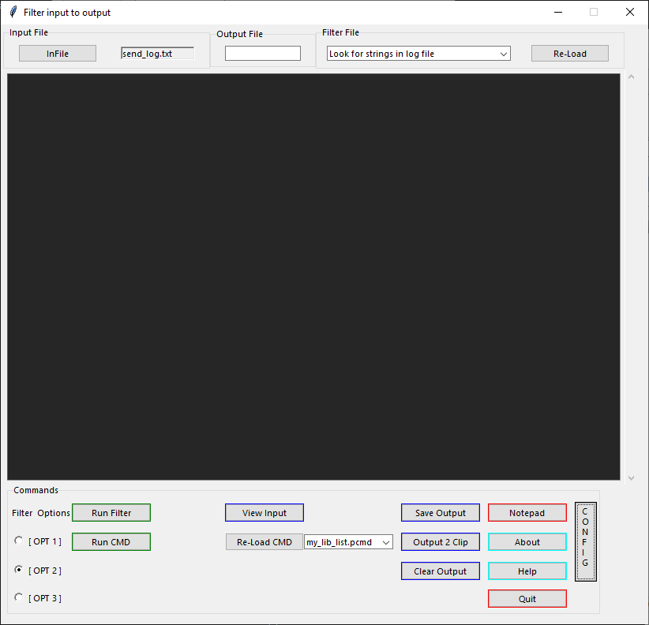
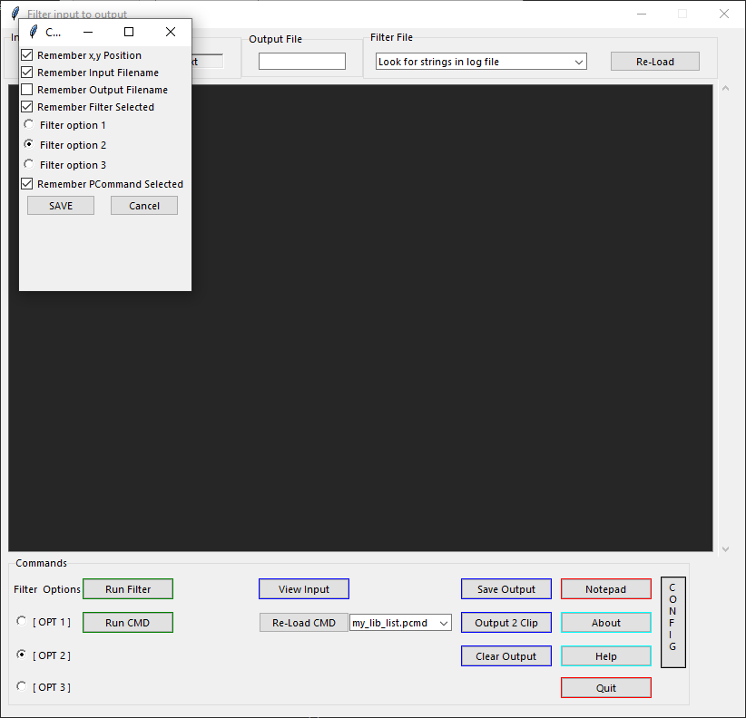
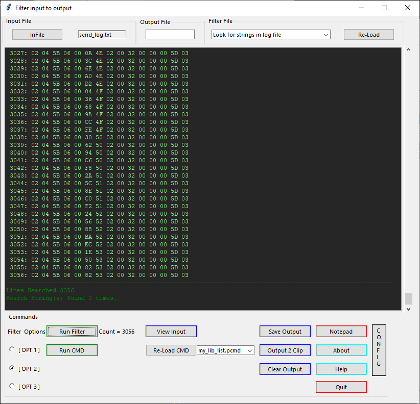

Project name: Filter
 
Author : Peter hedlund

Python Version : created in python 3.7

Code Version : 4.00

# UPDATE
1. Minor lower commands area layout changes.
2. Allow Purpose in pcmd files as well as flt files to better describe the
   pcmd.

Library Modules Needed :
* mylib/about.py
* mylib/help.py
* mylib/scrn_log.py
* mylib/to_log.py

[//]: # (This may be the most platform independent comment)

[comment]: # (This actually is the most platform independent comment)

Description: Text file search program to allow application of python filters to the input text.
The program can run filters (.flt) and Python Commands (.pcmd). Store these file types in their respective subdirectories.

The Reason I wrote this program was to help with my workflow on a project. I had a long, multiple compile project that generated
over a thousand lines of output into a text file. I needed a way to quickly find errors and warnings, then clear the output file
so I could start another run after fixing the errors. While I thought about a program specifically to deal with this issue, I opted
instead to write a generic gui interface that would accept different filters for different jobs and run different python scripts.
This allowed me to create the gui once and let me focus on just writing a simple filter to get the job done.
To the main gui I have features to select the filter or pcommand of your choice (loaded from the directory at startup). The ability
to re-scan both directorys (letting you add filters and use them without restarting the program.) The ability to save and clear the
scrolable text window as well as configure the program to remember certain settings. Please note that due to the greater use of the 
filters then the pcommands, The drop down for the filter has text from the filter file itself. In the filter file the string
/# Purpose:     Look for strings in log file
will put 'Look for strings in log file' in the combo box.

Table of Contents: 
* filter.pyw
* filter.ini
* read.me
* flt/
* pcmd/

<!-- use for desktop -->
<!-- 
## Main Program 

## Config Screen

## Running Filter

-->
<!-- use for github -->

## Main Program 

## Config Screen

## Running Filter

<!-- -->
